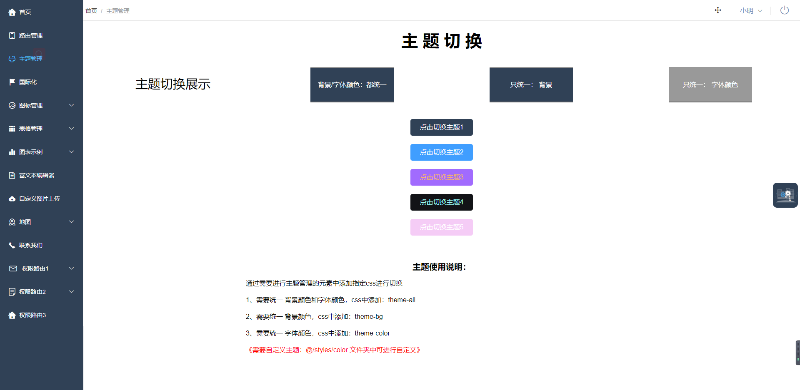

# 一、基于vue3.0+ts+Element通用后台admin模板

# 二、<a href="http://admin.yknba.cn/" target="_blank">在线预览地址：http://admin.yknba.cn/</a>

# 三、下载使用：
> ## 1、克隆代码
>> ```
>> 通过git将代码克隆到本地；或者使用下载安装包模式进行下载。
>> ```

> ## 2、进入目录
>> ```
>> 进入项目的根目录：vue3.0-ts-admin
>> ```

> ## 3、安装依赖
>> ```
>> npm install
>> ```

> ## 4、启动项目
>> ```
>> npm run dev
>> ```

---
# 四、所有文档说明已在项目中进行说明。

# 五、模板截图

***
***

***
***


> 更多信息请启动项目进行查看！
*****
*****
# 六、源码地址
> ## 1、<a href="https://github.com/chendongming0602/vue3.0-ts-admin" target="_blank">GitHub：https://github.com/chendongming0602/vue3.0-ts-admin</a>

> ## 2、<a href="https://gitee.com/MMinter/vue3.0-ts-admin" target="_blank">Gitee：https://gitee.com/MMinter/vue3.0-ts-admin</a>

> ## 3、<a href="https://mp.weixin.qq.com/s/MyITgO0d43D14wu1K7Mu0A" target="_blank">公众号：https://mp.weixin.qq.com/s/MyITgO0d43D14wu1K7Mu0A</a>
****
****
***
***
# 七、联系作者：

> ## &nbsp;&nbsp;微信添加：

 <br/>


 

> ## &nbsp;&nbsp;公众号添加：
 <br/>


<br/>
<br/>
<br/>

# <font color="red">如果该模板对你有帮助，记得点个star哦！